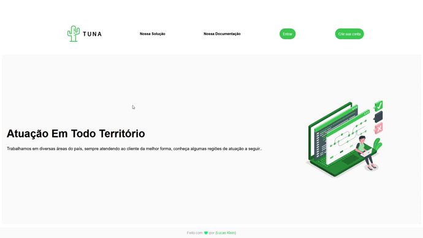

<h1 align="center"> Tuna Challenge - React</h1>

Projeto de landing page fictícia desenvolvido como um desafio oferecido pela empresa Tuna.

Deploy do projeto no Netlify para fácil visualização: https://tuna-challenge.netlify.app/

📖 - Funcionamento da aplicação: na página inicial, usa-se uma api para mostrar as localizações em que o serviço está presente atualmente

<h2>🚀 Tecnologias utilizadas: </h2>

- HTML
- CSS
- JavaScript
- React
- Styled Components
- Axios

<h2> 🎯 Ficou pendente: (Tuna me ajudou a refatorar o código) </h2>

 Opcionais 

- Adicionar maior flexibilidade ao código, por exemplo, se uma nova região fosse adicionada, o código se comportaria automaticamente e geraria o card (Implementado com ajuda da Tuna!)
  (Minha ideia base para isso seria utilizar o map no array original recebido pela api, buscar as regiões, transformar em um array e utilizar como um id para gerar os cards, e a cidades, com a regiões criando os cards, eu utilizaria o array original para mapear os nome da cidades e por corretamente nos devidos cards)

- Ordenar cada nome de estado no card de região alfebaticamente (Implementado com ajuda da Tuna!)

<h2>Para iniciar o projeto use: </h2>
git clone https://github.com/olucasklein/tuna-challenge.git

<h2>Para iniciar a aplicação:</h2>

- npm install
- npm run start

<h2>📝 Licença</h2>
Esse projeto está sob a licença MIT. Veja o arquivo LICENSE para mais detalhes.
